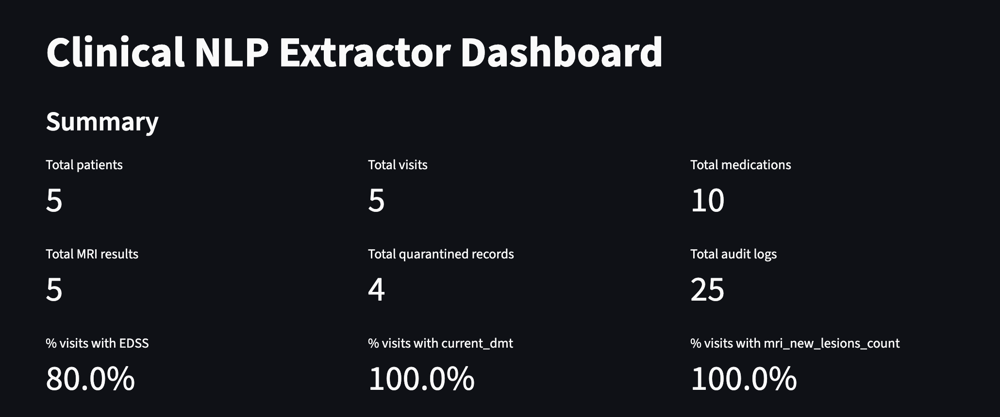
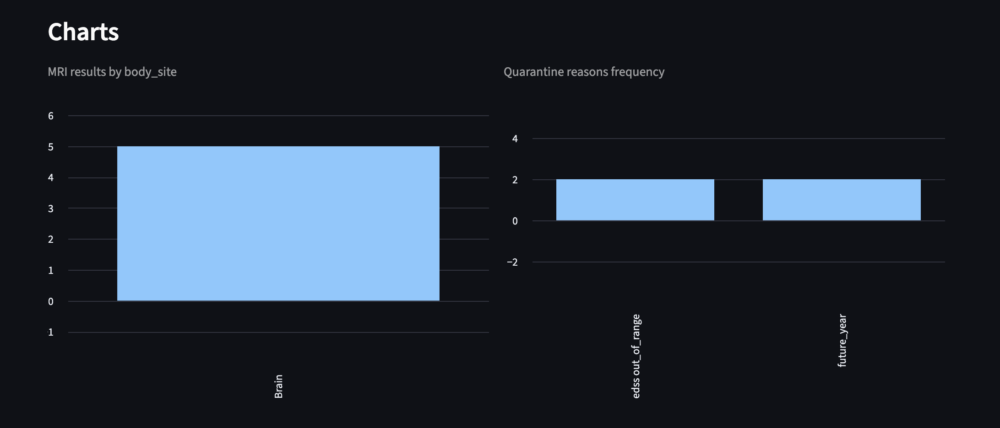
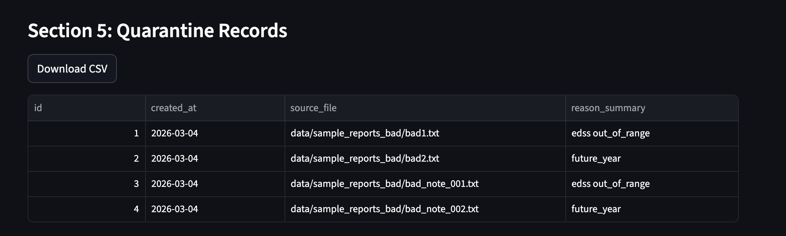
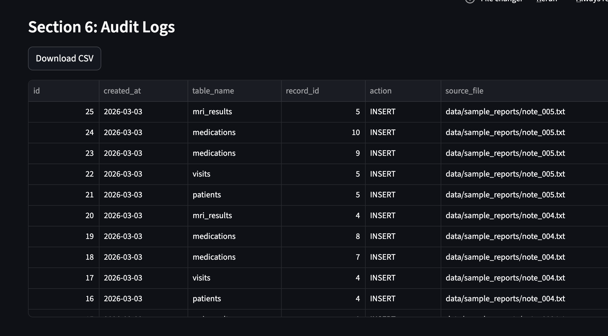

# Clinical NLP Extractor (Synthetic Starter)

This repository is a starter Python project for a clinical NLP-to-database workflow:

1. Read unstructured clinical note text files.
2. Extract structured entities (patient, visit, medications, MRI findings).
3. Persist normalized records to a relational database using SQLAlchemy.

It is designed as a scaffold you can extend into a production-grade pipeline.

## Why This Exists

Clinical text often contains critical details in free-text form. For analytics, quality review, operations, and downstream ML, teams typically need structured tables. This project gives you:

- a clean SQLAlchemy schema,
- a deterministic ingestion entry point,
- a spaCy-backed extraction scaffold,
- synthetic sample data and tests.

## Privacy and Safety Notes

- The included notes under `data/sample_reports/` are fully synthetic and do not contain real patient PHI.
- Do not commit real patient notes, MRNs, names, or identifiers into this repository.
- For real clinical deployments, you should add:
  - strict access control and authentication,
  - encryption at rest and in transit,
  - audit logging,
  - retention/deletion policies,
  - de-identification and minimum-necessary data handling,
  - compliance checks relevant to your jurisdiction (for example HIPAA in the US).

This scaffold is for development and demonstration, not compliance certification.

## Repository Layout

```text
.
├── data/sample_reports/      # 5 synthetic notes
├── scripts/                  # helper scripts for ingestion
├── src/
│   ├── extractor.py          # spaCy-based extraction scaffold
│   ├── ingest.py             # CLI entrypoint + ingestion loop
│   └── models.py             # SQLAlchemy models
├── tests/                    # basic unit/integration tests
└── README.md
```

## Data Model

- `Patient`: patient-level identity (MRN, name, optional DOB, optional diagnosis year, optional MS subtype)
- `Visit`: encounter-level data (visit date, note id, raw text, EDSS, current DMT, MRI new lesion count)
- `Medication`: medication mentions per visit
- `MRIResult`: MRI findings per visit (body site, finding, optional severity)
- `AuditLog`: ingestion audit trail (`id`, `created_at`, `action`, `table_name`, `record_id`, `source_file`, `details_json`)
- `QuarantineRecord`: rejected notes (`id`, `created_at`, `source_file`, `raw_text`, `extracted_json`, `errors_json`)

## Quickstart

Use Python 3.10+.

```bash
python -m venv .venv
source .venv/bin/activate
pip install -e .
```

`pip install -e .` installs project runtime dependencies, including SQLAlchemy and spaCy.

For tests and dev tooling:

```bash
pip install -e ".[dev]"
```

No spaCy language model download is required for this project right now; the extractor is rule/regex-based and runs with `spacy.blank("en")`.

## Run Ingestion

Exactly as requested:

```bash
python -m src.ingest --input data/sample_reports --db sqlite:///musicallite.db
```

You should see an output similar to:

```text
Ingested 5 note(s), already processed 0 note(s), quarantined 0 note(s), already quarantined 0 note(s) from data/sample_reports into sqlite:///musicallite.db
```

Helper wrapper:

```bash
python scripts/ingest_reports.py --input data/sample_reports --db sqlite:///musicallite.db
```

If a note contains invalid EDSS (>10) or a diagnosis year in the future, ingestion writes it to `quarantine_records` and skips inserts into main clinical tables for that note.
If the same bad file is ingested again, it is counted as `already quarantined` and is not re-inserted.
Synthetic invalid examples are available in `data/sample_reports_bad/`.

## Demo Dataset

The demo dataset in `data/sample_reports/` and `data/sample_reports_bad/` is synthetic only.
It contains no real patient identities or PHI and is intended strictly for local development and UI/demo workflows.

## Run Tests

```bash
pytest
```

## Validate Database Consistency

```bash
python -m src.validate --db sqlite:///musicallite.db
```

This prints a consistency report with PASS/FAIL checks for orphan visits, EDSS range, diagnosis year bounds, and other integrity rules.
Checks currently include:
- EDSS in `[0, 10]`
- diagnosis year `<=` current year
- visit `patient_id` foreign-key integrity
- medication name normalization (trimmed whitespace + consistent casing)

## View Audit Logs

```bash
python -m src.audit --db sqlite:///musicallite.db --limit 20
```

This prints newest `audit_logs` rows, including source note file and JSON details.

## View Quarantined Records

```bash
python -m src.quarantine --db sqlite:///musicallite.db --limit 10
```

This prints newest `quarantine_records` rows with `id`, `source_file`, and parsed reason summary from `errors_json`.

## Dashboard

Run commands:

```bash
python -m src.ingest --input data/sample_reports --db sqlite:///musicallite.db
```

```bash
streamlit run scripts/dashboard.py
```

## Dashboard

The Streamlit dashboard allows interactive exploration of extracted clinical data.

### Summary & Charts


### Data Governance (Quarantine + Audit Logs)


### Extracted Tables




## SQLite Migration

For existing SQLite files created before newer columns were added, run:

```bash
python scripts/migrate_sqlite.py --db sqlite:///musicallite.db
```

This checks columns via `PRAGMA table_info` and applies `ALTER TABLE` only for missing columns:
- `visits.edss`
- `patients.diagnosis_year`
- `patients.ms_subtype`
- `audit_logs.created_at`
- `audit_logs.source_file`
- `audit_logs.details_json`
- `quarantine_records.created_at`
- `quarantine_records.source_file`
- `quarantine_records.raw_text`
- `quarantine_records.extracted_json`
- `quarantine_records.errors_json`

## Backup and Restore

Create timestamped DB backups (keeps latest 14 by default):

```bash
python scripts/backup_db.py --db sqlite:///musicallite.db
```

Optional retention and output directory:

```bash
python scripts/backup_db.py --db sqlite:///musicallite.db --backup-dir backups --keep 14
```

Dry run:

```bash
python scripts/backup_db.py --db sqlite:///musicallite.db --dry-run
```

Restore from a backup file name (resolved from `backups/`) or full path:

```bash
python scripts/restore_db.py --db sqlite:///musicallite.db --backup musicallite_20260303_120000.db --force
```

Dry run:

```bash
python scripts/restore_db.py --db sqlite:///musicallite.db --backup musicallite_20260303_120000.db --force --dry-run
```

Safety behavior:
- restore refuses to overwrite an existing DB unless `--force` is provided,
- restore verifies the SQLite file header before replacing the target DB,
- when `--force` is used, it creates a pre-restore snapshot in `backups/`,
- restore writes via a temporary file and atomically replaces the target DB,
- backup/restore actions are appended to `logs/backup_restore.log` (configurable with `--log-file`).

## Extending the Extractor

`src/extractor.py` currently uses lightweight rules on top of spaCy pipeline loading. Typical next steps:

- add `EntityRuler` patterns for medications/anatomy/finding phrases,
- add negation handling,
- validate units/dose normalization,
- map findings to controlled vocabularies,
- add confidence scoring and extraction provenance,
- add note section parsing and temporal resolution.

## Important Caveat

This code is intentionally simple. It is not a diagnostic tool and should not be used for clinical decision-making without substantial validation, governance, and clinical oversight.
